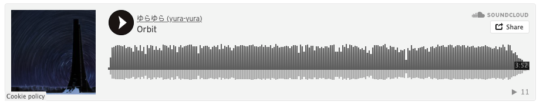

# hugo-shortcodes-soundcloud

Hugo shortcodes to embed SoundCloud on your site.

## Shortcodes

### User widget

Copy [soundcloud-user.html](./layouts/shortcodes/soundcloud-user.html) into your `layouts/shortcode/` directory.

#### Usage

```markdown

```

#### Example


### Playlist widget

Copy [soundcloud-playlist.html](./layouts/shortcodes/soundcloud-playlist.html) into your `layouts/shortcode/` directory.

#### Usage

```markdown

```

#### Example


### Track widget

Copy [soundcloud-track.html](./layouts/shortcodes/soundcloud-track.html) into your `layouts/shortcode/` directory.

#### Usage

```markdown

```

#### Example



## Notes

You can confirm `UserID`, `PlaylistID` or `TrackID` from the following URL (Paste your SoundCloud URL).

```
https://w.soundcloud.com/player/?url=<PASTE YOUR SOUNDCLOUD URL HERE>
```

Or you can use [SoundCloud HTTP API](https://developers.soundcloud.com/docs/api/reference) to get the IDs.
