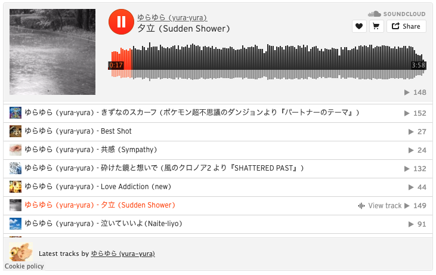
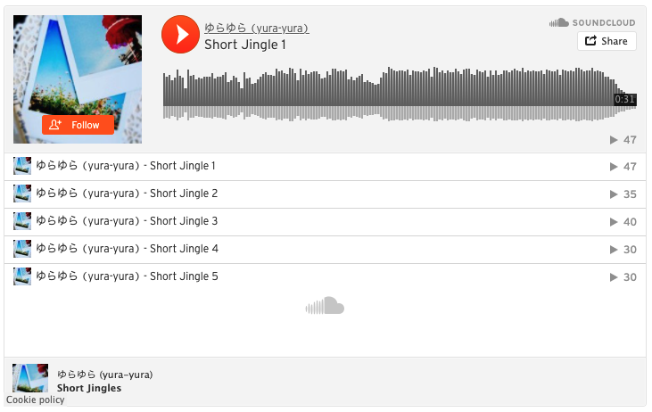

# hugo-shortcodes-soundcloud

Hugo shortcodes to embed SoundCloud on your site.

## Shortcodes

### User widget

Copy [soundcloud-user.html](./layouts/shortcodes/soundcloud-user.html) into your `layouts/shortcode/` directory.

#### Usage

```markdown

```

#### Example



### Playlist widget

Copy [soundcloud-playlist.html](./layouts/shortcodes/soundcloud-playlist.html) into your `layouts/shortcode/` directory.

#### Usage

```markdown

```

#### Example



## Notes

You can confirm `UserID` and `PlaylistID` by [SoundCloud HTTP API](https://developers.soundcloud.com/docs/api/reference).
